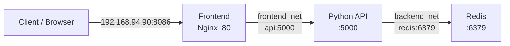

# Docker Compose Networks Lab

A production-minded learning lab that demonstrates service discovery, network segmentation, health-aware startup, and port exposure in Docker Compose.

The application uses two isolated bridge networks:

- `frontend_net` connects Nginx to the Python API.
- `backend_net` connects the Python API to Redis and is marked `internal`.
- The API is the only service attached to both networks.
- Redis and the API are not published directly on the Docker host.

## Architecture



| Service | Purpose | Networks | Published port |
|---|---|---|---|
| `frontend` | Nginx web UI and reverse proxy | `frontend_net` | `8086:80` |
| `api` | Python HTTP API and Redis connectivity check | `frontend_net`, `backend_net` | None |
| `redis` | Internal data service | `backend_net` | None |

## Lab environment

This project was designed for the following two-VM DevOps lab:

| Host | Address | Role in this lab |
|---|---|---|
| `DEV-1` | `192.168.94.90` | Runs this Compose project |
| `DEV-2` | `192.168.94.91` | Not modified; used to prove bridge networks are host-local |

Docker bridge networks do not span multiple hosts. A network created on `DEV-1` is not available on `DEV-2`.

## Learning objectives

- Understand the default Compose network behavior.
- Use Docker's embedded DNS and service names.
- Compare `ports` with `expose`.
- Attach one service to multiple networks.
- Isolate a backend service from the frontend.
- Use health checks for dependency-aware startup.
- Verify both expected connectivity and expected isolation.

## Repository structure

```text
.
├── .env.example
├── .github/
│   └── workflows/
│       └── validate.yml
├── backend/
│   ├── Dockerfile
│   └── app.py
├── docs/
│   ├── README.fa.md
│   ├── interview-questions.md
│   └── troubleshooting.md
├── frontend/
│   ├── Dockerfile
│   ├── default.conf
│   └── index.html
├── scripts/
│   └── verify.sh
├── .gitignore
├── compose.yaml
├── README.md
└── SECURITY.md
```

## Prerequisites

- Ubuntu Server
- Docker Engine
- Docker Compose v2
- `curl`
- TCP port `8086` available on the host

Check the prerequisites:

```bash
docker --version
docker compose version
sudo ss -lntp | grep ':8086' || echo "Port 8086 is free"
```

## Quick start

Clone the repository and enter the project directory:

```bash
git clone https://github.com/Arezoudehghan/docker-compose-labs.git
cd docker-compose-labs/session-36-networks
```

Create the local environment file:

```bash
cp .env.example .env
```

Validate the fully interpolated Compose configuration before starting containers:

```bash
docker compose --env-file .env config --quiet
```

Build and start the application:

```bash
docker compose up -d --build
```

Check container health:

```bash
docker compose ps
```

## Application verification

Test the Nginx health endpoint:

```bash
curl http://127.0.0.1:8086/health
```

Expected response:

```text
OK
```

Test the complete `Frontend -> API -> Redis` path:

```bash
curl http://127.0.0.1:8086/api/info
```

Expected response:

```json
{
  "status": "healthy",
  "api_container": "container-id",
  "redis_service": "redis:6379",
  "redis_response": "PONG"
}
```

Open the web interface:

```text
http://192.168.94.90:8086
```

## Network verification

List the project networks:

```bash
docker network ls --filter name=compose-networks-lab
```

Verify that Frontend can resolve and reach the API:

```bash
docker compose exec frontend nslookup api
docker compose exec frontend wget -qO- http://api:5000/health
```

Verify that the API can resolve Redis:

```bash
docker compose exec api python -c "import socket; print(socket.gethostbyname('redis'))"
```

Verify the expected isolation. This command should fail because Frontend and Redis do not share a network:

```bash
docker compose exec frontend nslookup redis
```

Verify that the internal services are not published on the host:

```bash
sudo ss -lntp | grep ':5000' || echo "API is not published on the host"
sudo ss -lntp | grep ':6379' || echo "Redis is not published on the host"
```

Run all non-destructive verification checks:

```bash
./scripts/verify.sh
```

## Security decisions

- Redis has no published host port.
- Redis is attached only to an internal backend network.
- Frontend cannot resolve or directly connect to Redis.
- The API runs as a non-root user with UID `10001`.
- No secrets are committed to the repository.
- `.env` is ignored; `.env.example` contains safe defaults only.
- Container IP addresses are not hard-coded.

## Stop and cleanup

Stop containers and remove project networks while preserving Redis data:

```bash
docker compose down
```

To also delete the Redis volume:

```bash
docker compose down -v
```

> **Warning:** `docker compose down -v` permanently deletes the project volume and its stored Redis data.

## Documentation

- [راهنمای فارسی](docs/README.fa.md)
- [Troubleshooting guide](docs/troubleshooting.md)
- [Interview questions](docs/interview-questions.md)
- [Security policy](SECURITY.md)

## Scope

This repository is an educational lab. It demonstrates sound Compose networking practices but is not a complete production platform. Production deployments should also include secrets management, TLS, resource limits, centralized logging, monitoring, backup, and an orchestration strategy.
